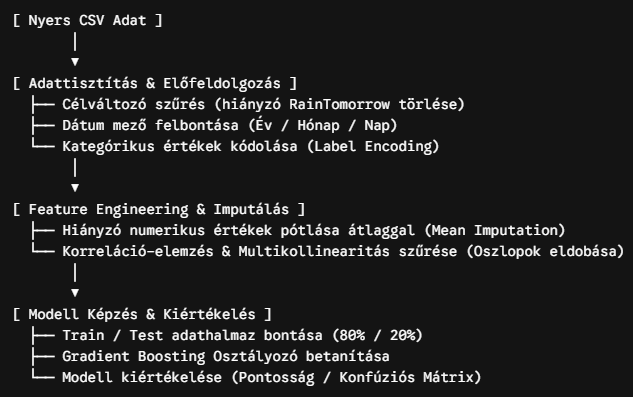
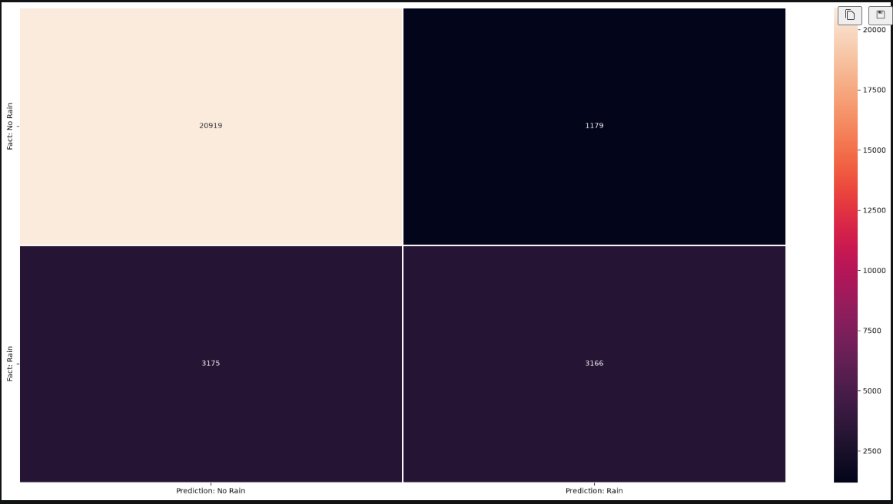

# Rain Prediction
## Cél
A projekt meteorológiai adatok alapján jósolja meg, hogy a következő napon várható-e eső gépi tanulási algoritmus segítségével.

## Architektúra

## Használt technológiák (Tech Stack)
    -   Nyelv: Python 3.x
    -   Adatkezelés: pandas, numpy
    -   Gépi tanulás: scikit-learn
    -   Adatvizualizáció: matplotlib, seaborn

## Adatelőkészítés és Tisztítás: 
    -   A hiányzó célváltozóval (RainTomorrow == NaN) rendelkező sorok eltávolítása.
    -   Dátum transzformáció: A Date mező átalakítása külön Year, Month, Day numerikus oszlopokká, majd az eredeti Date oszlop eldobása.
    -   Kategórikus kódolás: A szöveges jellegű kategórikus változók numerikussá alakítása LabelEncoder segítségével.
    -   Hiányzó adatok pótlása: A numerikus oszlopokban meglévő NaN értékek helyettesítése az adott oszlop átlagával (mean()).
    -   Multikollinearitás csökkentése: A korrelációs hőtérkép (Pearson-korreláció) elemzése alapján az erősen korreláló, redundáns oszlopok eltávolítása: Eltávolított oszlopok: MinTemp, MaxTemp, Pressure3pm, Temp9am

## Modell architektúra és Tanítás
    -   Modell: GradientBoostingClassifier
    -   Hiperparaméterek:
        -   n_estimators: 300
        -   learning_rate: 0.05
        -   random_state: 100
        -   max_features: 5
    -   Adatbontás: train_test_split (80% tanító, 20% tesztelő készlet, random_state=42).

## Eredmények és Modell teljesítmény
A tanított Gradient Boosting Classifier modell az alábbi teljesítményt érte el a tesztkészleten:
    Modell pontossága (Accuracy): 84%
    

    True Negative (TN): 20 897 esetben helyesen jósolta meg, hogy nem fog esni.
    True Positive (TP): 3 124 esetben helyesen jósolta meg, hogy fog esni.
    False Positive (FP): 1 201 esetben tévesen jósolt esőt.
    False Negative (FN): 3 217 esetben tévesen jósolt száraz időt.