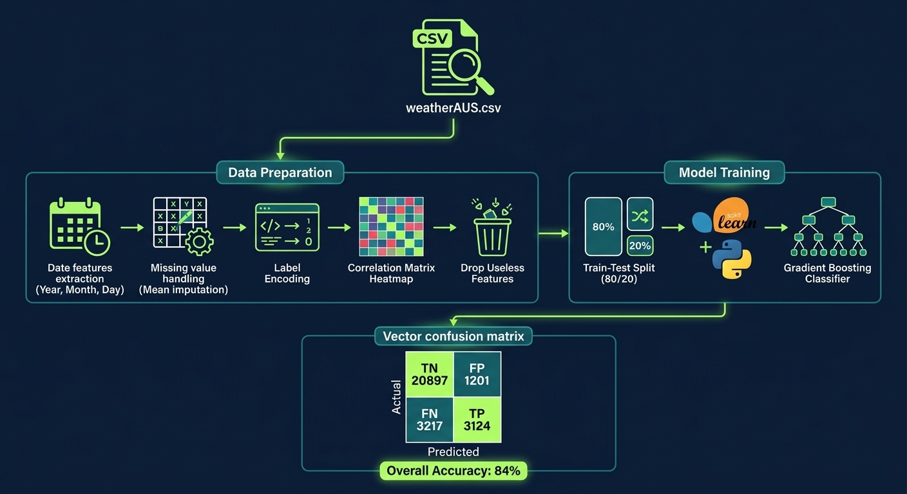
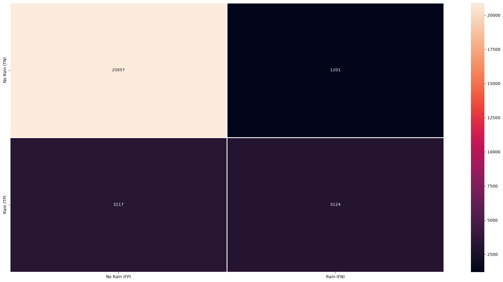

# Rain Prediction
> Machine Learning alapú időjárás-előrejelző pipeline az ausztráliai csapadék valószínűségének becslésére, átfogó adatprecedálással, korreláció-elemzéssel és Gradient Boosting osztályozóval.

[](https://www.python.org/)
[](https://scikit-learn.org/)
[](https://pandas.pydata.org/)

## Projekt Áttekintés

A projekt célja annak előrejelzése, hogy Ausztrália egyes régióiban esni fog-e az eső a következő napon. A modell több mint 140,000 meteorológiai megfigyelési adatot dolgoz fel (hőmérséklet, páratartalom, légnyomás, szélsebesség stb.), majd egy finomhangolt Gradient Boosting Classifier segítségével hoz döntést.

---

## Tech Stack

* **Nyelv:** Python
* **Adatkezelés & Előfeldolgozás:** `pandas`, `numpy`, `scikit-learn` (LabelEncoder, train_test_split)
* **Visualizáció:** `matplotlib`, `seaborn`
* **Gépi Tanulás:** `scikit-learn` (`GradientBoostingClassifier`, `AdaBoostClassifier`)
* **Adatforrás:** [Kaggle - Rain in Australia](https://www.kaggle.com/datasets/jsphyg/weather-dataset-rattle-package/data)

## High-Level Design (HLD)

Az alábbi diagram a teljes adattisztítási, transzformációs és modellezési folyamatot mutatja be:



## Adatfeldolgozás és Előkészítés

1. **Célváltozó tisztítása:** A hiányzó `RainTomorrow` rekordok eltávolításra kerültek (142,193 érvényes sor maradt).
2. **Feature Engineering:** A `Date` oszlop lebontásra került külön `Year`, `Month` és `Day` komponensekre.
3. **Imputáció:** A numerikus funkciók hiányzó értékeit (pl. `Evaporation`, `Sunshine`, `Cloud`) az oszlopok átlagával (`mean()`) pótoltuk.
4. **Multikollinearitás szűrése:** A korrelációs mátrix alapján eltávolításra kerültek a redundáns mezők:
   - `MinTemp`, `MaxTemp`, `Pressure3pm`, `Temp9am`

---

## Modellezés és Eredmények

A modellhez egy korlátozott mélységű, finomhangolt **Gradient Boosting Classifiert** használtunk.

### Beállítások:
- `n_estimators`: 300
- `learning_rate`: 0.05
- `max_features`: 5
- `random_state`: 100
## Eredmények és Modell teljesítmény
A tanított Gradient Boosting Classifier modell az alábbi teljesítményt érte el a tesztkészleten:
    Modell pontossága (Accuracy): 84%
    


    True Negative (TN): 20 897 esetben helyesen jósolta meg, hogy nem fog esni.
    True Positive (TP): 3 124 esetben helyesen jósolta meg, hogy fog esni.
    False Positive (FP): 1 201 esetben tévesen jósolt esőt.
    False Negative (FN): 3 217 esetben tévesen jósolt száraz időt.

## Telepítés és Futtatás

### Előfeltételek
Győződj meg róla, hogy a Python 3.8+ telepítve van a gépeden.

### 1. Repository klónozása
```bash
git clone [https://github.com/felhasznalonev/australian-weather-ml.git](https://github.com/felhasznalonev/australian-weather-ml.git)
cd australian-weather-ml
```

### 2. Függőségek telepítése
```bash
pip install pandas numpy matplotlib seaborn scikit-learn
```

### 3. Adathalmaz letöltése
Töltsd le a `weatherAUS.csv` fájlt a [Kaggle-ről](https://www.kaggle.com/datasets/jsphyg/weather-dataset-rattle-package/data), és helyezd a projekt gyökérkönyvtárába.

### 4. A script futtatása
```bash
python main.py
```
## Mérnöki Döntések és Kihívások

* **Túlzott korreláció Kezelése:** A hőtérképes  korrelációs vizsgálat rávilágított, hogy a reggeli/délutáni hőmérséklet és légnyomás adatok erősen korrelálnak egymással. A túlillesztés  elkerülése és a modell leegyszerűsítése érdekében a 4 leginkább redundáns oszlopot manuálisan eltávolítottuk.
* **Erősen Hiányos Adatok:** A `Sunshine`, `Evaporation` és `Cloud` oszlopok 35-47%-ban hiányosak voltak. Az átlaggal való helyettesítés  gyors megoldást nyújtott a modell futtatásához anélkül, hogy értékes sorokat kellett volna törölni.
